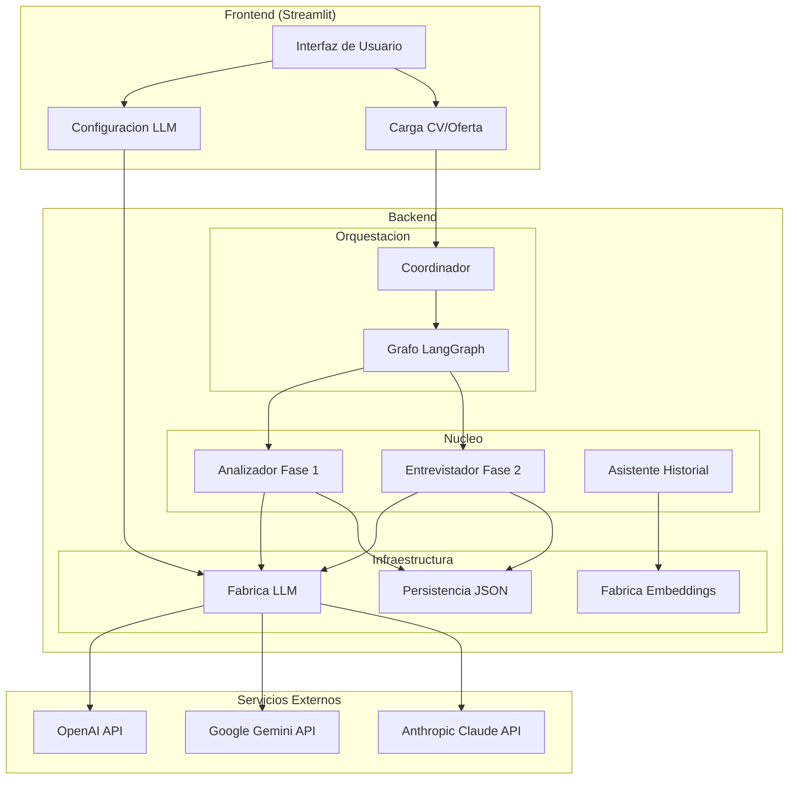

# Documentacion Tecnica Extendida

Sistema de Evaluacion de Candidatos con IA | Carlos Vega | Enero 2026

---

## Videodemo

Para visualizar el sistema operando a pleno rendimiento, consulta la **videodemo interactiva**:

**[Ver Videodemo del Sistema](https://youtu.be/M3Q2oyQY-ok)**

---

## 1. Arquitectura del Sistema

### Vision General



### Gestion de Credenciales

Las **API keys de los proveedores LLM se configuran exclusivamente desde la interfaz web**. El backend requiere archivo `.env`, pero no necesariamente configuracion previa de credenciales. Esta decision arquitectonica:

- Simplifica el despliegue y la experiencia de usuario
- Permite cambiar de proveedor en tiempo de ejecucion sin reiniciar
- Evita exposicion accidental de credenciales en repositorios

---

## 2. Pipeline de Procesamiento


---

## 3. Analisis de Requisitos de la Prueba

### Fase 1: Analisis Automatico

La prueba especifica un sistema que recibe oferta y CV, extrae requisitos clasificandolos como obligatorios u opcionales, y evalua cumplimiento.

**Implementacion**:

- **Structured Output**: Se utiliza `with_structured_output()` de LangChain con modelos Pydantic. Esto garantiza respuestas en formato tipado sin necesidad de parsing manual, eliminando errores de formato.

- **Puntuacion proporcional**: Si hay N requisitos y se cumplen M, el score es `(M/N) * 100`. Si falta un requisito obligatorio, el candidato queda descartado con score 0%.

- **Niveles de confianza**: Cada match incluye nivel de confianza (`high`, `medium`, `low`) con razonamiento explicito del LLM.

### Fase 2: Entrevista Conversacional

Si el candidato no fue descartado pero hay requisitos no encontrados en el CV, el sistema inicia conversacion para recopilar informacion adicional.

**Implementacion**:

- **Entrevista por requisito**: El sistema pregunta por cada requisito faltante de forma individual, manteniendo contexto conversacional.

- **Streaming real**: Las respuestas del LLM se muestran token por token para mejor experiencia de usuario.

- **Recalculo automatico**: Tras cada respuesta, el sistema actualiza el estado y recalcula la puntuacion final.

---

## 4. Decisiones de Diseno

### Arquitectura por Capas

Se implementa separacion clara de responsabilidades:

```
nucleo/           # Logica de negocio pura, sin dependencias de infraestructura
orquestacion/     # Coordinacion de flujos y gestion de estados
infraestructura/  # Integraciones externas (LLM, persistencia, scraping)
recursos/         # Configuracion centralizada (prompts, hiperparametros)
```

Esta estructura permite modificar la infraestructura (cambiar de proveedor LLM, migrar persistencia) sin afectar la logica de negocio. Cada capa tiene responsabilidad unica y dependencias unidireccionales.

### Orquestacion con LangGraph

Se utiliza LangGraph para definir un grafo de estados donde cada nodo representa una operacion atomica (extraccion, matching, entrevista). El grafo gestiona:

- Transiciones condicionales basadas en el estado (si hay faltantes, ir a entrevista)
- Tipado fuerte del estado con `TypedDict`
- Puntos de control para debugging y trazabilidad

### Structured Output con Pydantic

Todas las interacciones con el LLM utilizan modelos Pydantic como schema de respuesta. Esto proporciona:

- Validacion automatica de tipos en tiempo de ejecucion
- Eliminacion de parsing manual de strings
- Documentacion implicita del contrato de datos

---

## 5. Calibracion y Versatilidad LLM

### Proceso de Calibracion

El sistema se calibro exhaustivamente utilizando **GPT-4o de OpenAI** como modelo de referencia. El proceso incluyo:

1. **Ajuste de temperatura por contexto**: Tareas de extraccion requieren determinismo (temp=0.0), mientras entrevistas se benefician de variabilidad moderada (temp=0.3).

2. **Optimizacion de top_p**: Valores altos (0.95) para tareas precisas, reducidos (0.85-0.90) para mayor creatividad controlada.

3. **Validacion cruzada**: Pruebas con multiples ofertas y CVs para verificar consistencia de resultados.

### Compatibilidad Multi-Proveedor

El sistema soporta tres proveedores LLM intercambiables:

| Proveedor | LLM | Embeddings | Notas |
|-----------|-----|------------|-------|
| **OpenAI** | GPT-4o, GPT-4o-mini | text-embedding-3-small | Proveedor de referencia para calibracion |
| **Google** | Gemini 1.5 Pro/Flash | text-embedding-004 | Alternativa con buen balance coste/rendimiento |
| **Anthropic** | Claude 3.5 Sonnet | No disponible | Solo LLM, sin embeddings propios |

La seleccion de proveedor se realiza desde la interfaz sin necesidad de reiniciar el sistema.

---

## 6. Hiperparametros Detallados

### Configuracion por Fase

| Fase | Contexto | Temperature | Top-P | Descripcion | Impacto |
|------|----------|-------------|-------|-------------|---------|
| **Fase 1** | Extraccion | 0.0 | 0.95 | Extraccion de requisitos de la oferta | Determinista: misma entrada produce misma salida. Critico para consistencia en identificacion de requisitos. |
| **Fase 1** | Matching | 0.1 | 0.95 | Evaluacion de cumplimiento CV vs requisitos | Minima variabilidad para evaluaciones reproducibles. Ligera flexibilidad para manejar sinonimos. |
| **Fase 2** | Entrevista | 0.3 | 0.90 | Generacion de preguntas conversacionales | Moderada creatividad para preguntas naturales y variadas. Evita repeticiones mecanicas. |
| **Fase 2** | Evaluacion | 0.2 | 0.95 | Evaluacion de respuestas del candidato | Balance entre precision y capacidad de interpretar respuestas informales. |
| **RAG** | Chatbot Historial | 0.4 | 0.85 | Consultas sobre evaluaciones previas | Mayor variabilidad para respuestas contextuales y conversacionales. |

### Recomendaciones de Configuracion

- **Alta precision requerida**: Reducir temperature a 0.0-0.1
- **Conversaciones naturales**: Mantener temperature en 0.3-0.4
- **Respuestas diversas**: Aumentar temperature hasta 0.5-0.6 (no recomendado para evaluaciones)

---

## 7. Funcionalidades Adicionales

### Embeddings Semanticos con FAISS

Se implementa busqueda vectorial para complementar el analisis del LLM. El sistema genera embeddings del CV y los compara con cada requisito para encontrar coincidencias semanticas que el analisis textual podria omitir.

**Dimensiones optimizadas**: OpenAI embeddings configurados a 512 dimensiones (vs 1536 default) para reducir latencia manteniendo precision.

### RAG para Historial de Evaluaciones

El chatbot de historial utiliza Retrieval-Augmented Generation para responder consultas sobre evaluaciones previas. El usuario puede preguntar en lenguaje natural sobre sus resultados anteriores.

### Scraping con Playwright

Se integra Playwright para extraccion de ofertas desde URLs. Esto permite:

- Extraccion de paginas con JavaScript dinamico
- Manejo de sitios con carga diferida
- Bypass de protecciones basicas anti-scraping

---

## 8. Interfaz de Usuario

Se utiliza Streamlit como framework de interfaz. Esta eleccion proporciona:

- **Desarrollo rapido**: Prototipado eficiente sin frontend separado
- **Interactividad nativa**: Widgets reactivos sin JavaScript manual
- **Compatibilidad Docker**: Despliegue sencillo en contenedor

La interfaz implementa el sistema de diseno corporativo Velora con paleta de colores turquesa, tipografia Inter, y componentes visuales consistentes.

---

## 9. Despliegue con Docker

Se utiliza Docker como metodo de instalacion recomendado. El Dockerfile implementa:

- **Multi-stage build**: Separacion de dependencias y codigo para imagen final optimizada
- **Usuario no-root**: Ejecucion con usuario `velora` por seguridad
- **Playwright preinstalado**: Chromium incluido para scraping funcional out-of-the-box
- **Health checks**: Verificacion de disponibilidad para orquestadores

---

Carlos Vega | Enero 2025
