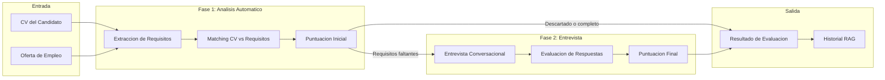

# Sistema de Evaluacion de Candidatos con IA

Prueba tecnica para Ingeniero de IA Generativa | Carlos Vega | Enero 2025

---

## Videodemo

Para visualizar el sistema operando a pleno rendimiento, consulta la **videodemo interactiva**:

**[Ver Videodemo del Sistema](https://youtu.be/tu-video-id)**

---

## Inicio Rapido con Docker

```bash
git clone https://github.com/carlosvegag1/velora-prueba-carlos.git
cd velora-prueba-carlos
docker compose up --build
```

Acceder a **http://localhost:8501**

**Nota sobre API Keys**: Las credenciales de los proveedores LLM (OpenAI, Google, Anthropic) se configuran directamente desde la **interfaz web**. No es necesario modificar archivos de configuracion ni variables de entorno en el backend.

Primera ejecucion tarda 3-5 minutos (instalacion de dependencias y Chromium para scraping).

---

## Arquitectura del Sistema



---

## Instalacion Manual

### Requisitos
- Python 3.9+
- Navegador Chromium (instalado automaticamente via Playwright)

### Pasos

```bash
python -m venv venv
# Linux/Mac: source venv/bin/activate
# Windows: venv\Scripts\activate
pip install -r requirements.txt
playwright install chromium
streamlit run frontend/streamlit_app.py
```

Las **API keys** se introducen en la interfaz web al iniciar la aplicacion.

---

## Implementacion Tecnica

### Por que estas tecnologias

| Componente | Tecnologia | Justificacion |
|------------|------------|---------------|
| **Orquestacion** | LangGraph | Control granular sobre flujos multi-agente con estados tipados |
| **LLM Integration** | LangChain | Abstraccion sobre multiples proveedores, structured output nativo |
| **Embeddings** | FAISS | Busqueda vectorial eficiente para matching semantico |
| **Frontend** | Streamlit | Desarrollo rapido de interfaces interactivas para prototipado |
| **Scraping** | Playwright | Extraccion de contenido de paginas con JavaScript dinamico |

### Calibracion del Sistema

El sistema se calibro exhaustivamente utilizando **GPT-4o de OpenAI** como modelo de referencia. Los hiperparametros fueron ajustados para optimizar precision en extraccion y naturalidad en entrevistas.

**Compatibilidad multi-proveedor**: El sistema funciona con OpenAI, Anthropic (Claude) y Google (Gemini), permitiendo seleccionar el proveedor desde la interfaz.

---

## Hiperparametros por Fase

| Fase | Contexto | Temperature | Top-P | Comportamiento |
|------|----------|-------------|-------|----------------|
| **Fase 1** | Extraccion | 0.0 | 0.95 | Determinista, maxima precision |
| **Fase 1** | Matching | 0.1 | 0.95 | Baja variabilidad, consistencia en evaluaciones |
| **Fase 2** | Entrevista | 0.3 | 0.90 | Moderada creatividad para conversacion natural |
| **Fase 2** | Evaluacion | 0.2 | 0.95 | Balance entre precision y flexibilidad |
| **RAG** | Chatbot Historial | 0.4 | 0.85 | Mayor variabilidad para respuestas contextuales |

---

## Cumplimiento de Requisitos

| Requisito | Implementacion |
|-----------|----------------|
| Fase 1: Analisis CV vs Oferta | **Structured Output** con Pydantic para extraccion y matching |
| Requisitos obligatorios vs opcionales | Flag `discarded` cuando falta obligatorio, score 0% |
| Puntuacion proporcional | `score = (cumplidos / total) * 100` |
| Fase 2: Entrevista conversacional | **Streaming real** preguntando por requisitos no encontrados |
| Recalculo post-entrevista | Reevaluacion automatica tras respuestas |
| LangChain con proveedores intercambiables | Fabrica LLM con soporte OpenAI, Google, Anthropic |
| Docker | Multi-stage build optimizado con Playwright preinstalado |
| Interfaz UI | Streamlit con diseno corporativo Velora |

---

## Estructura del Proyecto

```
backend/
  modelos.py              # Modelos Pydantic para structured output
  nucleo/                 # Logica de negocio: analisis, entrevista, historial
  orquestacion/           # Coordinadores y grafo LangGraph
  infraestructura/        # Proveedores LLM, embeddings, persistencia
  recursos/               # Prompts centralizados
frontend/
  streamlit_app.py        # Interfaz de usuario
docs/
  ejemplos/               # CVs y ofertas de prueba
```

---

## Solucion de Problemas

**Error: "API key not found"**
Introduce la API key en el panel lateral de la interfaz web. No se requiere configuracion en archivos.

**Docker: "Port 8501 already in use"**
```bash
docker compose down
# O cambiar puerto: VELORA_PORT=8502 docker compose up
```

---

Para documentacion tecnica detallada, ver [README-EXTENSO.md](README-EXTENSO.md).

**Carlos Vega**
