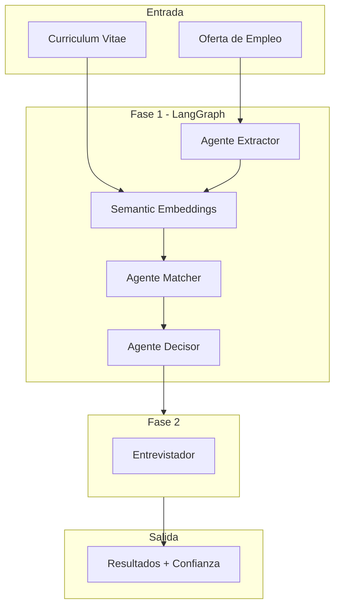

# Sistema de Evaluación de Candidatos con LangChain

Sistema de evaluación automática de candidatos mediante análisis de CVs y entrevistas interactivas con IA. Utiliza las capacidades más avanzadas de **LangChain** para garantizar respuestas válidas y fiables.

## Características Principales

### Core LangChain
- **Structured Output**: Respuestas del LLM siempre válidas y tipadas con Pydantic
- **Multi-proveedor**: Soporte para OpenAI, Google (Gemini) y Anthropic (Claude)

### Vanguardia (Nuevas Características)
- ** LangGraph**: Orquestación multi-agente para análisis estructurado
- ** Embeddings Semánticos**: FAISS para búsqueda de evidencia en el CV
- ** Niveles de Confianza**: Cada match incluye confianza (alta/media/baja) y razonamiento
- ** LangSmith**: Trazabilidad completa y feedback loop para mejora continua
- ** Streaming**: Progreso en tiempo real del análisis
- ** RAG para Historial**: Chatbot inteligente para consultar tu historial de evaluaciones

### Interfaz
- **UI Streamlit**: Interfaz moderna con indicadores visuales de confianza
- **Extracción de URLs/PDFs**: Descarga automática de ofertas de empleo

## Instalación

```bash
# Crear entorno virtual
python -m venv venv
source venv/bin/activate # Linux/Mac
# o: venv\Scripts\activate # Windows

# Instalar dependencias
pip install -r requirements.txt

# Instalar navegador para scraping de URLs protegidas (anti-bot)
playwright install chromium
```

## Configuración

Crea un archivo `.env` con tu API key:

```env
OPENAI_API_KEY=sk-...

# Opcionales:
# GOOGLE_API_KEY=...
# ANTHROPIC_API_KEY=...
# LANGSMITH_API_KEY=... # Para trazabilidad
```

## Uso

### Interfaz Web (Streamlit)

```bash
streamlit run app/streamlit_app.py
```

### Uso Programático

```python
from src.evaluator import CandidateEvaluator
from src.evaluator.core import Phase1Analyzer

# Modo simple
evaluator = CandidateEvaluator(
 provider="openai",
 model_name="gpt-4"
)

result = evaluator.evaluate_candidate(
 job_offer_text="Requisitos obligatorios: ...",
 cv_text="Experiencia: ..."
)

print(f"Puntuación: {result.final_score}%")
print(f"Descartado: {result.final_discarded}")

# Modo avanzado con LangGraph y Embeddings
analyzer = Phase1Analyzer(
 provider="openai",
 model_name="gpt-4",
 use_semantic_matching=True, # Embeddings FAISS
 use_langgraph=True # Orquestación multi-agente
)

result = analyzer.analyze(job_offer_text, cv_text)

# Acceder a confianza y razonamiento
for req in result.fulfilled_requirements:
 print(f" {req.description}")
 print(f" Confianza: {req.confidence.value}")
 print(f" Razonamiento: {req.reasoning}")
 if req.semantic_score:
 print(f" Score semántico: {req.semantic_score:.2f}")
```

## Arquitectura



## Estructura del Proyecto

```
src/evaluator/
├── __init__.py
├── models.py # Modelos Pydantic + ConfidenceLevel
├── core/
│ ├── evaluator.py # Orquestador principal + LangSmith
│ ├── analyzer.py # Fase 1 con soporte LangGraph
│ ├── graph.py # Definición del grafo LangGraph
│ ├── embeddings.py # SemanticMatcher con FAISS
│ └── interviewer.py # Fase 2: Entrevista
├── llm/
│ ├── factory.py # Factory multi-proveedor + LangSmith config
│ └── prompts.py # Prompts con soporte de confianza
├── extraction/
│ ├── pdf.py # Extracción de PDFs
│ └── url.py # Scraping de URLs
├── processing/
│ └── validation.py # Utilidades
├── storage/
│ └── memory.py # Persistencia + EnrichedEvaluation
└── rag/
 ├── vectorstore.py # HistoryVectorStore con FAISS
 └── chatbot.py # HistoryChatbot RAG
```

## Flujo de Evaluación

```
1. Fase 1: Análisis (LangGraph opcional)
 ├── Nodo 1: Extraer requisitos (Structured Output)
 ├── Nodo 2: Generar embeddings del CV (FAISS)
 ├── Nodo 3: Matching semántico + LLM verification
 └── Nodo 4: Calcular puntuación + confianza

2. Fase 2: Entrevista (opcional)
 ├── Generar preguntas para requisitos faltantes
 ├── Recopilar respuestas del candidato
 └── Evaluar respuestas y re-calcular puntuación
```

## Reglas de Puntuación

- **100%**: Todos los requisitos cumplidos
- **0%**: Falta algún requisito obligatorio (candidato descartado)
- **Proporcional**: Según requisitos cumplidos vs totales

## Chatbot RAG para Historial

El sistema incluye un chatbot inteligente que permite consultar tu historial de evaluaciones usando RAG (Retrieval Augmented Generation).

### Ejemplos de Consultas

| Consulta | Respuesta Esperada |
|----------|-------------------|
| *"¿Por qué me rechazaron la última vez?"* | Análisis detallado de requisitos no cumplidos |
| *"¿Cuáles son mis puntos fuertes?"* | Requisitos que cumples consistentemente |
| *"¿Qué requisitos me faltan más?"* | Análisis de brechas frecuentes |
| *"Compara mis dos últimas evaluaciones"* | Evolución entre evaluaciones |

### Uso Programático del RAG

```python
from src.evaluator.rag import HistoryChatbot, HistoryVectorStore
from src.evaluator.storage import UserMemory
from src.evaluator.llm import LLMFactory

# Crear LLM
llm = LLMFactory.create(provider="openai", model_name="gpt-4o-mini")

# Crear chatbot
chatbot = HistoryChatbot(user_id="mi_usuario", llm=llm)

# Consultar historial
respuesta = chatbot.query("¿Por qué me rechazaron?")
print(respuesta)

# Ver documentos consultados
for doc in chatbot.last_retrieved_docs:
 print(doc.metadata)
```

## Niveles de Confianza

| Nivel | Significado | Visualización |
|-------|-------------|---------------|
| HIGH | Evidencia explícita en CV | Verde |
| MEDIUM | Evidencia inferida | Amarillo |
| LOW | Sin evidencia clara | Rojo |

## Dependencias Principales

- `langchain` / `langchain-openai` / `langchain-core`
- `langgraph` - Orquestación multi-agente
- `langsmith` - Trazabilidad y feedback
- `faiss-cpu` - Embeddings semánticos
- `streamlit` - Interfaz web
- `pydantic` - Validación de datos
- `playwright` - Scraping avanzado con navegador headless (anti-bot)

## Licencia

MIT
