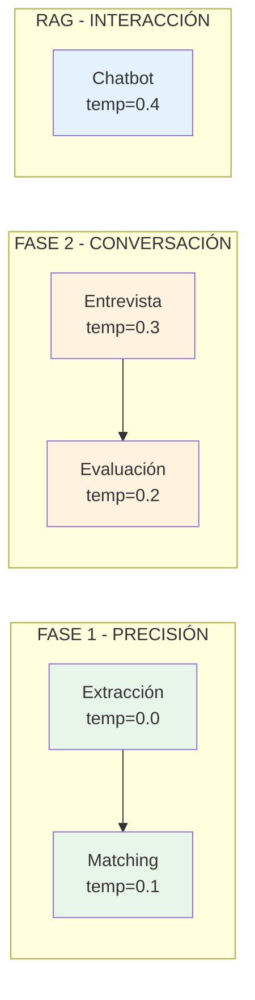

# ️ Guía de Hiperparámetros de LLM - Velora Auto Evaluator

## Resumen Ejecutivo

Este documento explica cómo se configuran los hiperparámetros de los modelos de lenguaje (LLMs) en el sistema, por qué se usan valores específicos para cada contexto, y cómo garantizamos compatibilidad entre proveedores.

---

## Qué son los Hiperparámetros de LLM

Los hiperparámetros controlan el comportamiento del modelo al generar texto:

| Parámetro | Rango | Efecto |
|-----------|-------|--------|
| **temperature** | 0.0 - 2.0 | Control de aleatoriedad. Bajo = determinista, Alto = creativo |
| **top_p** | 0.0 - 1.0 | Nucleus sampling. Controla diversidad de vocabulario |
| **max_tokens** | 1 - ∞ | Límite de longitud de respuesta |

### Temperature: El Parámetro Más Importante

```
temperature = 0.0 Siempre elige la palabra más probable
temperature = 0.5 Equilibrio entre coherencia y variedad
temperature = 1.0 Alta creatividad, puede ser impredecible
temperature = 2.0 Muy aleatorio, posible incoherencia
```

---

## Configuración por Contexto en Velora

### Visión General



### Tabla de Configuración Completa

| Contexto | Temperature | top_p | Justificación |
|----------|-------------|-------|---------------|
| **Extracción de Requisitos** | 0.0 | 0.95 | Máxima consistencia en identificación |
| **Matching CV-Requisitos** | 0.1 | 0.95 | Precisión en evaluación objetiva |
| **Generación de Preguntas** | 0.3 | 0.90 | Naturalidad sin perder foco |
| **Evaluación de Respuestas** | 0.2 | 0.95 | Interpretación contextual precisa |
| **Chatbot RAG** | 0.4 | 0.85 | Conversación fluida y amigable |

---

## Implementación en Código

### Ubicación de Configuración

```
src/evaluator/llm/hyperparameters.py Configuración centralizada
```

### Uso en Componentes

```python
from src.evaluator.llm import HyperparametersConfig

# Obtener temperatura para un contexto
temp = HyperparametersConfig.get_temperature("phase1_extraction") # 0.0

# Obtener configuración completa
config = HyperparametersConfig.get_config("rag_chatbot")
print(config.temperature) # 0.4
print(config.top_p) # 0.85

# Ver todos los contextos disponibles
contexts = HyperparametersConfig.list_contexts()
# ['phase1_extraction', 'phase1_matching', 'phase2_interview', ...]
```

### Integración con LLMFactory

```python
from src.evaluator.llm import LLMFactory, HyperparametersConfig

# Crear LLM con hiperparámetros específicos para contexto
config = HyperparametersConfig.get_config("phase1_matching")

llm = LLMFactory.create_llm(
 provider="openai",
 model_name="gpt-4o",
 temperature=config.temperature, # 0.1
)
```

---

## Compatibilidad Cross-Provider

### Parámetros Universales (Usamos Estos)

| Parámetro | OpenAI | Google Gemini | Anthropic Claude |
|-----------|--------|---------------|------------------|
| temperature | | | |
| top_p | | | |
| max_tokens | | (max_output_tokens) | |

### Parámetros Específicos (NO Usamos)

| Parámetro | Proveedor | Por qué NO lo usamos |
|-----------|-----------|---------------------|
| frequency_penalty | OpenAI only | No portable |
| presence_penalty | OpenAI only | No portable |
| top_k | Varía | Comportamiento inconsistente |
| stop_sequences | Varía | Manejado por LangChain |

### Código que Garantiza Portabilidad

```python
# En LLMFactory.create_llm():
kwargs = {
 "model": model_name,
 "temperature": temperature, # Universal
}
# Solo pasamos parámetros que funcionan en TODOS los proveedores
```

---

## Justificación Detallada por Fase

### FASE 1: Extracción y Matching

**Objetivo:** Precisión y consistencia absoluta

**¿Por qué temperature = 0.0-0.1?**

1. **Reproducibilidad:** La misma oferta debe generar los mismos requisitos
2. **Objetividad:** El matching no debe depender de "suerte"
3. **Auditabilidad:** Resultados verificables y explicables

**Ejemplo de impacto:**

```
Con temperature = 0.0:
 Requisito: "5 años de experiencia en Python" SIEMPRE igual

Con temperature = 0.8:
 Requisito 1: "5 años de experiencia en Python"
 Requisito 2: "Experiencia significativa en Python (5+ años)"
 Requisito 3: "Media década trabajando con Python"
 INCONSISTENTE
```

### FASE 2: Entrevista Interactiva

**Objetivo:** Naturalidad sin perder coherencia

**¿Por qué temperature = 0.2-0.3?**

1. **Variedad:** Las preguntas no deben sonar robóticas
2. **Adaptabilidad:** Pequeñas variaciones mejoran la experiencia
3. **Control:** No tan alto como para generar incoherencias

**Ejemplo:**

```
Con temperature = 0.0:
 "¿Puede describir su experiencia con Python?" Siempre igual, robótico

Con temperature = 0.3:
 "¿Podría contarme sobre su experiencia con Python?"
 "¿Cómo describiría su trayectoria trabajando con Python?"
 Natural, variado, coherente
```

### RAG Chatbot

**Objetivo:** Conversación fluida basada en datos

**¿Por qué temperature = 0.4?**

1. **El contexto RAG proporciona los datos:** No necesitamos precisión extrema
2. **Respuestas amigables:** El usuario espera interacción natural
3. **Síntesis creativa:** Combinar información de múltiples evaluaciones

**Ejemplo:**

```
Pregunta: "¿Cómo me ha ido en general?"

Con temperature = 0.1:
 "Has tenido 3 evaluaciones. Promedio: 75%. 2 aprobadas."
 Correcto pero frío

Con temperature = 0.4:
 "¡Vas muy bien! De tus 3 evaluaciones, aprobaste 2 con un 
 promedio de 75%. Tu punto fuerte es la experiencia técnica."
 Informativo y amigable
```

---

## ️ Cómo Ajustar Hiperparámetros

### Paso 1: Identificar el Contexto

```python
# Ver contextos disponibles
from src.evaluator.llm import HyperparametersConfig
print(HyperparametersConfig.list_contexts())
```

### Paso 2: Modificar en hyperparameters.py

```python
# Ubicación: src/evaluator/llm/hyperparameters.py

# Antes:
PHASE1_MATCHING = LLMHyperparameters(
 temperature=0.1,
 top_p=0.95,
)

# Después (si quieres más determinismo):
PHASE1_MATCHING = LLMHyperparameters(
 temperature=0.0, # Cambio
 top_p=0.95,
)
```

### Paso 3: Sin Cambios en Lógica de Negocio

Los componentes leen la configuración automáticamente. No necesitas modificar:
- `analyzer.py`
- `interviewer.py`
- `evaluator.py`
- `chatbot.py`

---

## Métricas de Rendimiento por Configuración

| Configuración | Consistencia | Creatividad | Caso de Uso |
|---------------|--------------|-------------|-------------|
| temp=0.0 | | | Extracción de datos |
| temp=0.1 | | | Matching y evaluación |
| temp=0.3 | | | Generación de preguntas |
| temp=0.5 | | | Resúmenes creativos |
| temp=0.7+ | | | Brainstorming (no usado) |

---

## Verificación de Configuración

```python
# Script de verificación
from src.evaluator.llm import HyperparametersConfig

configs = HyperparametersConfig.get_all_configs()
for context, params in configs.items():
 print(f"{context}: temp={params['temperature']}, top_p={params.get('top_p', 'N/A')}")
```

**Salida esperada:**
```
phase1_extraction: temp=0.0, top_p=0.95
phase1_matching: temp=0.1, top_p=0.95
phase2_interview: temp=0.3, top_p=0.9
phase2_evaluation: temp=0.2, top_p=0.95
rag_chatbot: temp=0.4, top_p=0.85
summary: temp=0.3, top_p=0.9
```

---

## Garantías del Sistema

1. **Independencia de proveedor:** Mismo comportamiento con OpenAI, Gemini, Claude
2. **Configuración centralizada:** Un solo archivo para todos los ajustes
3. **Sin dependencias ocultas:** No usamos parámetros provider-specific
4. **Fácil ajuste:** Cambiar valores sin tocar lógica de negocio
5. **Documentado:** Justificación clara para cada decisión

---

**Última actualización:** Diciembre 2024 
**Versión:** 2.2.0

