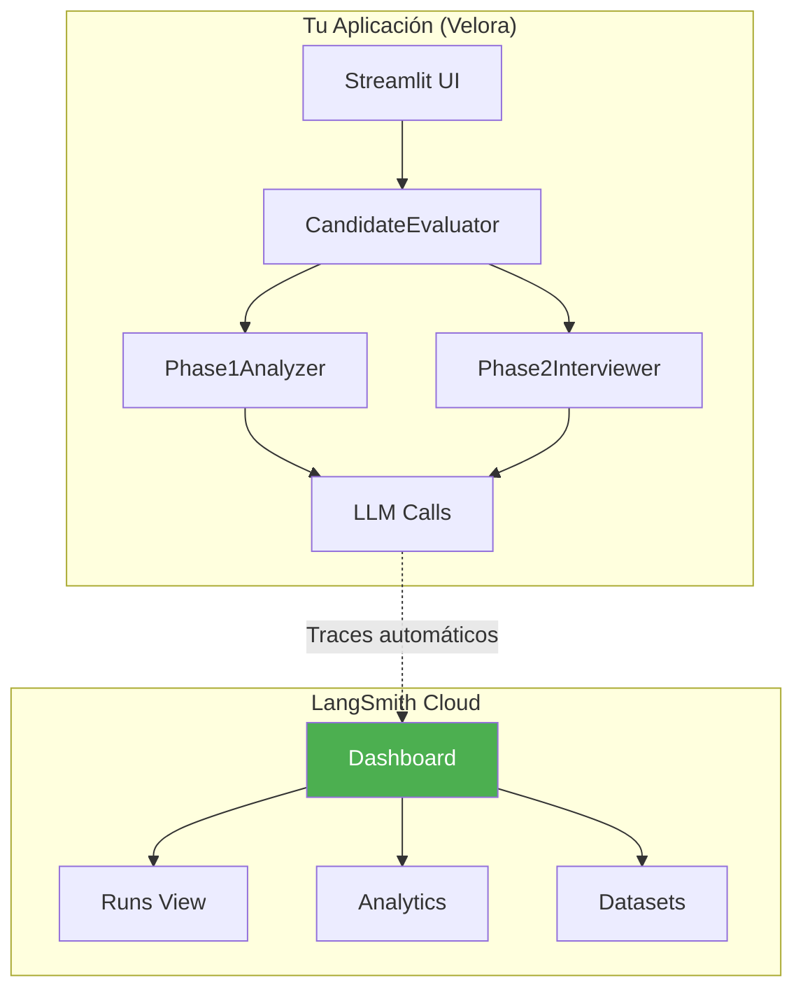
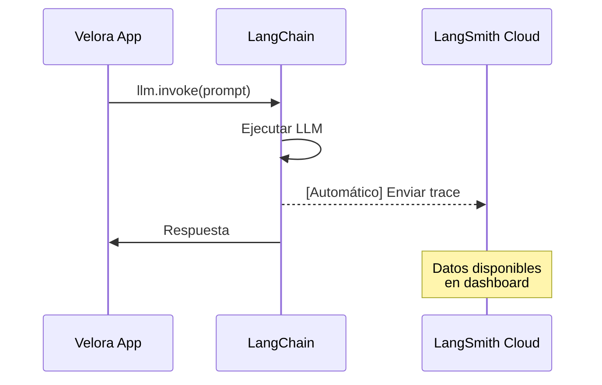

# Guía Completa de LangSmith - Velora Auto Evaluator

## Para Principiantes Absolutos

Esta guía explica LangSmith desde cero, qué es, por qué existe, cómo funciona en nuestro sistema, y qué valor aporta.

---

## Parte 1: Fundamentos de LangSmith

### ¿Qué es LangSmith?

**LangSmith** es una plataforma de observabilidad y debugging para aplicaciones que usan LLMs (modelos de lenguaje como GPT, Gemini, Claude).

**Analogía simple:** 
- Si tu aplicación fuera un coche, LangSmith sería el **panel de diagnóstico del taller mecánico**
- Te permite ver exactamente qué pasó dentro del motor cuando algo falla
- También te ayuda a optimizar el rendimiento cuando todo funciona

### ¿Qué Problema Resuelve?

Sin LangSmith:
```
Usuario: "La evaluación falló"
Desarrollador: "¿Qué prompt se envió? ¿Qué respondió el LLM? ¿Cuánto tardó?"
 No tenemos idea, es una caja negra 
```

Con LangSmith:
```
Usuario: "La evaluación falló"
Desarrollador: "Veo que el prompt tenía 2000 tokens, el LLM tardó 8 segundos,
 y la respuesta no tenía el formato JSON esperado"
 Diagnóstico preciso y solución rápida 
```

### Conceptos Core

| Concepto | Qué es | Ejemplo en Velora |
|----------|--------|-------------------|
| **Trace** | Registro completo de una ejecución | Una evaluación completa (Fase 1 + Fase 2) |
| **Run** | Una llamada individual al LLM | Extracción de requisitos, Matching CV |
| **Span** | Subdivisión de un Run | Paso de chunking dentro de extracción |
| **Feedback** | Valoración de calidad | "Esta evaluación fue correcta/incorrecta" |
| **Dataset** | Conjunto de ejemplos | Pares oferta-CV para testing |

### Arquitectura Visual



---

## Parte 2: Nuestra Implementación

### Cómo se Activa

LangSmith se activa **automáticamente** cuando existe la variable de entorno:

```bash
# En tu .env o variables de entorno
LANGSMITH_API_KEY=ls-xxxxxxxxxxxxxxxxxxxxxxxxxxxxxxxx
```

### Código de Activación

```python
# Ubicación: src/evaluator/llm/factory.py

def configure_langsmith(project_name: str = "velora-evaluator"):
 """
 Configura LangSmith para trazabilidad.
 Se ejecuta automáticamente al iniciar CandidateEvaluator.
 """
 api_key = os.getenv("LANGSMITH_API_KEY")
 if not api_key:
 return None # Sin API key, no se activa
 
 # Habilitar tracing de LangChain
 os.environ["LANGCHAIN_TRACING_V2"] = "true"
 os.environ["LANGCHAIN_PROJECT"] = project_name
 
 return LangSmithClient()
```

### ¿Qué Datos se Suben?

| Dato | Se Sube | Ejemplo |
|------|---------|---------|
| **Prompts** | Sí | "Extrae los requisitos de esta oferta..." |
| **Respuestas LLM** | Sí | JSON con requisitos extraídos |
| **Tokens usados** | Sí | Input: 1500, Output: 300 |
| **Latencia** | Sí | 2.3 segundos |
| **Modelo usado** | Sí | gpt-4o, gemini-pro, claude-3 |
| **Metadata** | Sí | user_id, timestamp, fase |
| **Errores** | Sí | Traceback completo si falla |
| **CV/Oferta completa** | ️ Parcial | Solo lo que va en el prompt |

### ¿Cómo se Suben los Datos?



**Proceso:**
1. **Trigger:** Cada llamada a un LLM via LangChain
2. **Frecuencia:** Inmediata (real-time)
3. **Modo:** Automático (si `LANGCHAIN_TRACING_V2=true`)
4. **Formato:** JSON estructurado via API REST

---

## Parte 3: Valor y Casos de Uso

### Objetivos Inmediatos (Hoy)

| Objetivo | Cómo LangSmith Ayuda |
|----------|---------------------|
| **Debugging** | Ver exactamente qué prompt causó un error |
| **Monitoreo** | Detectar si las respuestas son más lentas de lo normal |
| **Auditoría** | Registro de todas las evaluaciones realizadas |
| **Optimización** | Identificar prompts que generan respuestas pobres |

### Valor Futuro (Próximos Meses)

| Capacidad | Descripción |
|-----------|-------------|
| **Fine-tuning** | Usar traces exitosos para entrenar modelos custom |
| **A/B Testing** | Comparar rendimiento entre diferentes prompts |
| **Evaluaciones** | Tests automáticos de calidad de respuestas |
| **Análisis de Costos** | Optimizar uso de tokens y gastos |
| **Datasets** | Crear conjuntos de prueba para regresiones |

---

## Parte 4: Casos de Uso Prácticos

### Caso 1: Debuggear una Evaluación Fallida

**Escenario:** Un usuario reporta "La evaluación no extrajo ningún requisito"

**Sin LangSmith:**
```
 "No sé qué pasó, tendría que reproducir el error"
```

**Con LangSmith:**
1. Ir a https://smith.langchain.com
2. Filtrar por `project: velora-evaluator`
3. Buscar el trace con error
4. Ver el prompt exacto que se envió
5. Ver la respuesta del LLM
6. **Diagnóstico:** "El LLM devolvió JSON mal formado porque el prompt no especificaba el formato"

```
 Dashboard LangSmith:
├── Run: extract_requirements
│ ├── Input: "Extrae requisitos de: [oferta de 5000 caracteres]"
│ ├── Output: "Los requisitos son: 1. Python 2. AWS..." (texto plano, no JSON)
│ ├── Latency: 3.2s
│ └── Error: ValidationError - Expected JSON
└── Fix: Añadir "Responde SOLO en formato JSON" al prompt
```

### Caso 2: Analizar Qué Prompts Funcionan Mejor

**Escenario:** Queremos mejorar la precisión del matching

**Con LangSmith:**
1. Exportar todos los runs de `match_cv_requirements`
2. Filtrar por evaluaciones donde el usuario dio feedback positivo
3. Comparar prompts de evaluaciones exitosas vs fallidas
4. **Insight:** "Los prompts que incluyen ejemplos concretos tienen 30% más precisión"

### Caso 3: Auditar el RAG Conversacional

**Escenario:** Queremos verificar que el chatbot responde correctamente

**Con LangSmith:**
1. Filtrar traces del chatbot RAG
2. Ver qué documentos se recuperaron para cada pregunta
3. Verificar que las respuestas usan la información correcta
4. **Auditoría:** "El 95% de las respuestas citan correctamente el historial"

---

## Parte 5: Dashboard y Métricas

### Métricas Disponibles

| Métrica | Descripción | Uso |
|---------|-------------|-----|
| **Latency (P50, P95, P99)** | Tiempo de respuesta | Detectar degradación |
| **Token Usage** | Consumo por ejecución | Control de costos |
| **Error Rate** | % de ejecuciones fallidas | Alertas de calidad |
| **Success Rate** | % de ejecuciones exitosas | KPI principal |
| **Throughput** | Ejecuciones por minuto | Capacidad del sistema |

### Visualizaciones

```
 LangSmith Dashboard
│
├── Latency Over Time
│ └── Gráfico de líneas mostrando tiempos de respuesta
│
├── Token Usage by Model
│ └── Barras comparando consumo GPT-4 vs Gemini
│
├── Error Distribution
│ └── Pie chart de tipos de errores
│
└── Recent Traces
 └── Lista de las últimas 100 ejecuciones
```

---

## Parte 6: Privacidad y Seguridad

### ¿Qué Implicaciones Tiene Subir Datos?

| Aspecto | Consideración |
|---------|---------------|
| **Datos sensibles** | Los prompts pueden contener CVs/ofertas |
| **Retención** | LangSmith retiene datos según tu plan |
| **Compliance** | Verificar cumplimiento GDPR si aplica |
| **Acceso** | Solo usuarios autorizados del proyecto |

### Configuraciones de Privacidad

```python
# Opción 1: Desactivar LangSmith completamente
# No configurar LANGSMITH_API_KEY

# Opción 2: Anonimizar datos sensibles antes de enviar
# (Requiere implementación custom)

# Opción 3: Usar LangSmith Self-Hosted (Enterprise)
# Datos nunca salen de tu infraestructura
```

### Gestión de Retención

- **Plan Free:** 14 días de retención
- **Plan Plus:** 90 días de retención
- **Plan Enterprise:** Configurable + opción self-hosted

### Alternativas

| Alternativa | Descripción | Trade-off |
|-------------|-------------|-----------|
| **Logs locales** | Guardar traces en archivos | Sin dashboard |
| **OpenTelemetry** | Estándar abierto | Más complejo |
| **Custom DB** | Guardar en tu propia DB | Más desarrollo |

---

## Parte 7: Cómo Empezar

### Paso 1: Obtener API Key

1. Ir a https://smith.langchain.com
2. Crear cuenta (gratis)
3. Ir a Settings API Keys
4. Crear nueva API Key

### Paso 2: Configurar en Velora

```bash
# Añadir a tu .env
LANGSMITH_API_KEY=ls-xxxxxxxxxxxxxxxxxxxxxxxxxxxxxxxx
```

### Paso 3: Verificar Activación

```python
from src.evaluator.llm import is_langsmith_enabled

if is_langsmith_enabled():
 print(" LangSmith activo - Los traces se están enviando")
else:
 print(" LangSmith no configurado")
```

### Paso 4: Ver Traces

1. Ejecutar una evaluación en Velora
2. Ir a https://smith.langchain.com
3. Seleccionar proyecto "velora-evaluator"
4. Ver el trace de la evaluación

---

## Parte 8: Resumen de Beneficios

### Para Desarrolladores

- Debugging rápido con contexto completo
- Identificación de prompts problemáticos
- Optimización de tokens y costos
- Reproducibilidad de errores

### Para Usuarios de Negocio

- Auditoría completa de evaluaciones
- Métricas de calidad del sistema
- Evidencia para compliance
- Datos para mejora continua

### Para el Sistema

- Observabilidad end-to-end
- Alertas automáticas
- Base para A/B testing
- Datasets para regresión

---

## FAQ

### ¿LangSmith es obligatorio?

**No.** El sistema funciona perfectamente sin LangSmith. Es una herramienta de observabilidad opcional.

### ¿Cuánto cuesta?

- **Free:** 3,000 traces/mes
- **Plus:** $39/mes - 10,000 traces/mes
- **Enterprise:** Custom

### ¿Afecta el rendimiento?

**Mínimamente.** Los traces se envían de forma asíncrona, sin bloquear la ejecución principal.

### ¿Puedo desactivarlo temporalmente?

**Sí.** Solo elimina o comenta la variable `LANGSMITH_API_KEY`.

### ¿Funciona con Gemini/Claude?

**Sí.** LangSmith traza cualquier LLM usado a través de LangChain, independientemente del proveedor.

---

## Recursos Adicionales

- [Documentación oficial de LangSmith](https://docs.smith.langchain.com/)
- [LangSmith Dashboard](https://smith.langchain.com/)
- [Guía de Observabilidad LangChain](https://python.langchain.com/docs/guides/debugging)
- [LangSmith API Reference](https://docs.smith.langchain.com/api-reference)

---

**Última actualización:** Diciembre 2024 
**Versión del documento:** 1.0

