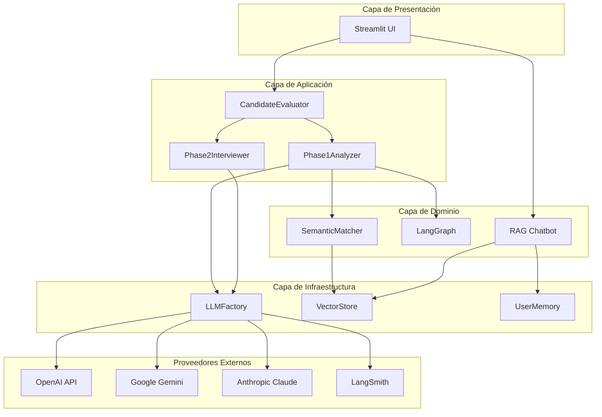
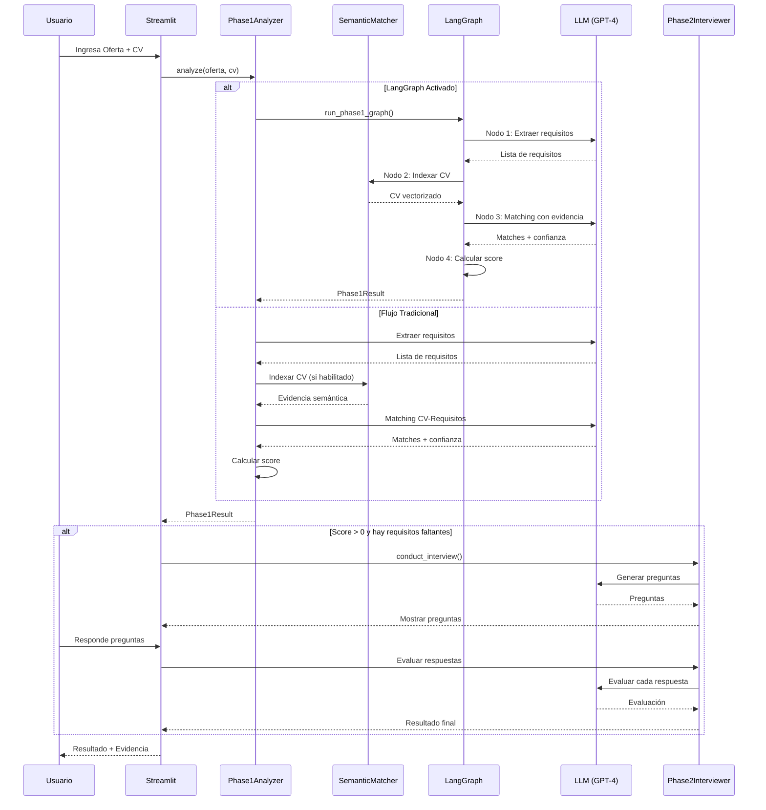
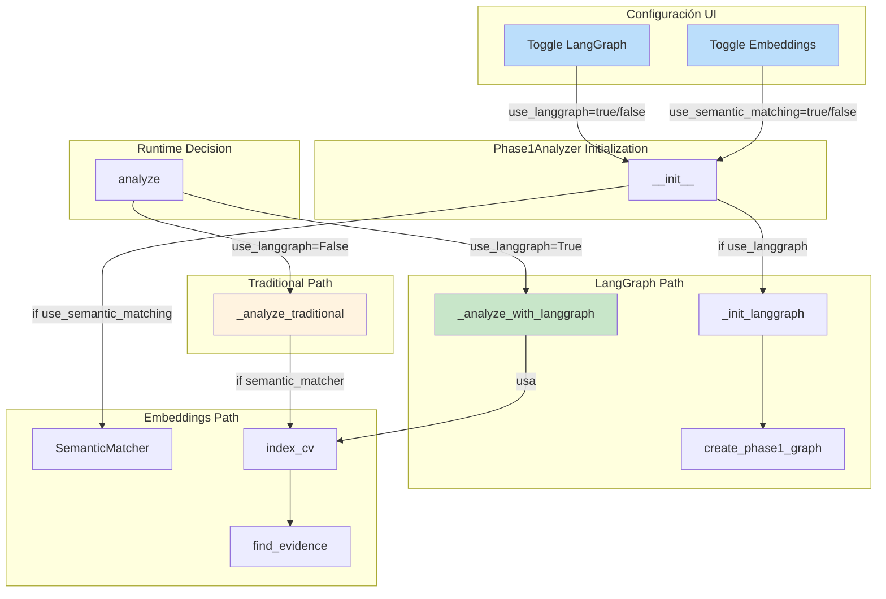
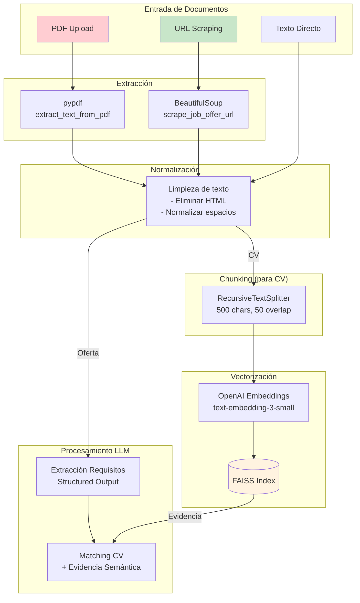
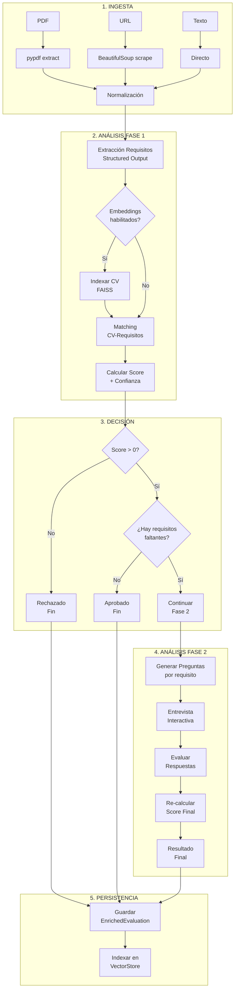

# Documentación Técnica Completa

## Sistema de Evaluación de Candidatos con LangChain

> **Versión**: 2.1.0 
> **Última actualización**: Diciembre 2024 
> **Stack principal**: Python 3.9+ | LangChain | LangGraph | FAISS | Streamlit

---

## Índice

1. [Resumen Ejecutivo](#1-resumen-ejecutivo)
2. [Arquitectura Técnica del Sistema](#2-arquitectura-técnica-del-sistema)
3. [Stack Tecnológico](#3-stack-tecnológico)
4. [Patrones de Diseño Implementados](#4-patrones-de-diseño-implementados)
5. [Diagramas Técnicos](#5-diagramas-técnicos)
6. [LangChain como Pilar Tecnológico](#6-langchain-como-pilar-tecnológico)
7. [Sistema RAG Conversacional](#7-sistema-rag-conversacional)
8. [Funcionalidades Premium Opcionales](#8-funcionalidades-premium-opcionales)
9. [Pipeline de Procesamiento](#9-pipeline-de-procesamiento)
10. [Arquitectura de Código](#10-arquitectura-de-código)
11. [Sistema de Logging Operacional](#11-sistema-de-logging-operacional)
12. [Gestión de Configuraciones](#12-gestión-de-configuraciones)
13. [Estrategias de Escalabilidad](#13-estrategias-de-escalabilidad)
14. [Guía de Despliegue](#14-guía-de-despliegue)
15. [Métricas y Observabilidad](#15-métricas-y-observabilidad)

---

## 1. Resumen Ejecutivo

### 1.1 ¿Qué es este sistema?

El **Sistema de Evaluación de Candidatos** es una solución empresarial de Inteligencia Artificial que automatiza el proceso de evaluación de candidatos contra ofertas de empleo. Utiliza las capacidades más avanzadas de **LangChain** para garantizar evaluaciones precisas, trazables y escalables.

### 1.2 Propuesta de Valor

| Para Stakeholders | Beneficio |
|-------------------|-----------|
| **Reclutadores** | Reduce tiempo de evaluación de 6-7 minutos a 30-60 segundos por candidato |
| **Managers** | Criterios objetivos y consistentes eliminan sesgo humano |
| **Candidatos** | Evaluación justa basada en evidencia documentada |
| **IT/DevOps** | Arquitectura modular, escalable y observable |

### 1.3 Capacidades Principales

```
┌─────────────────────────────────────────────────────────────────────────┐
│ CAPACIDADES DEL SISTEMA │
├─────────────────────────────────────────────────────────────────────────┤
│ │
│ CORE PREMIUM (OPCIONAL) │
│ ───────────────── ─────────────────────── │
│ Extracción de requisitos LangGraph Multi-Agente │
│ Matching CV-Requisitos Embeddings Semánticos FAISS │
│ Entrevista interactiva RAG para Historial │
│ Multi-proveedor LLM LangSmith Trazabilidad │
│ Niveles de confianza Streaming en tiempo real │
│ Persistencia de historial Logging operacional │
│ │
└─────────────────────────────────────────────────────────────────────────┘
```

---

## 2. Arquitectura Técnica del Sistema

### 2.1 Visión General de Capas

El sistema implementa una **arquitectura por capas** que separa claramente las responsabilidades:

```
┌─────────────────────────────────────────────────────────────────────────┐
│ CAPA DE PRESENTACIÓN │
│ (Streamlit UI) │
├─────────────────────────────────────────────────────────────────────────┤
│ │
│ ┌─────────────────┐ ┌─────────────────┐ ┌─────────────────┐ │
│ │ Nueva │ │ Historial │ │ Opciones │ │
│ │ Evaluación │ │ + RAG Chat │ │ Avanzadas │ │
│ └─────────────────┘ └─────────────────┘ └─────────────────┘ │
│ │
├─────────────────────────────────────────────────────────────────────────┤
│ CAPA DE ORQUESTACIÓN │
│ (CandidateEvaluator) │
├─────────────────────────────────────────────────────────────────────────┤
│ │
│ ┌───────────────────────────────┐ ┌───────────────────────────────┐ │
│ │ FASE 1 │ │ FASE 2 │ │
│ │ Phase1Analyzer │ │ Phase2Interviewer │ │
│ │ ┌─────────────────────┐ │ │ ┌─────────────────────┐ │ │
│ │ │ LangGraph (opcional)│ │ │ │ Generación preguntas│ │ │
│ │ │ Embeddings (opcional)│ │ │ │ Evaluación respuesta│ │ │
│ │ └─────────────────────┘ │ │ └─────────────────────┘ │ │
│ └───────────────────────────────┘ └───────────────────────────────┘ │
│ │
├─────────────────────────────────────────────────────────────────────────┤
│ CAPA DE SERVICIOS │
├─────────────────────────────────────────────────────────────────────────┤
│ │
│ ┌──────────────┐ ┌──────────────┐ ┌──────────────┐ ┌─────────────┐ │
│ │ LLMFactory │ │ SemanticMatch│ │ RAG/Vector │ │ UserMemory │ │
│ │ (LLMs) │ │ (FAISS) │ │ (Historial) │ │ (Storage) │ │
│ └──────────────┘ └──────────────┘ └──────────────┘ └─────────────┘ │
│ │
├─────────────────────────────────────────────────────────────────────────┤
│ CAPA DE INFRAESTRUCTURA │
├─────────────────────────────────────────────────────────────────────────┤
│ │
│ ┌──────────────┐ ┌──────────────┐ ┌──────────────┐ ┌─────────────┐ │
│ │ OpenAI │ │ Google │ │ Anthropic │ │ LangSmith │ │
│ │ API │ │ Gemini │ │ Claude │ │ Tracing │ │
│ └──────────────┘ └──────────────┘ └──────────────┘ └─────────────┘ │
│ │
└─────────────────────────────────────────────────────────────────────────┘
```

### 2.2 Componentes Principales

| Componente | Ubicación | Responsabilidad |
|------------|-----------|-----------------|
| **CandidateEvaluator** | `core/evaluator.py` | Orquestador principal que coordina las fases |
| **Phase1Analyzer** | `core/analyzer.py` | Extracción de requisitos y matching con CV |
| **Phase2Interviewer** | `core/interviewer.py` | Generación de preguntas y evaluación de respuestas |
| **SemanticMatcher** | `core/embeddings.py` | Búsqueda de evidencia semántica con FAISS |
| **LangGraph** | `core/graph.py` | Orquestación multi-agente |
| **LLMFactory** | `llm/factory.py` | Factory para creación de LLMs multi-proveedor |
| **HistoryChatbot** | `rag/chatbot.py` | Chatbot RAG para consultas de historial |
| **UserMemory** | `storage/memory.py` | Persistencia de evaluaciones |

---

## 3. Stack Tecnológico

### 3.1 Tecnologías Core

```mermaid
mindmap
 root((Stack Tecnológico))
 LangChain Ecosystem
 langchain-core
 langchain-openai
 langchain-community
 langgraph
 langsmith
 AI/ML
 OpenAI GPT-4
 Google Gemini
 Anthropic Claude
 FAISS Embeddings
 Backend
 Python 3.9+
 Pydantic v2
 Structured Output
 Frontend
 Streamlit
 Real-time Streaming
 Storage
 JSON Files
 FAISS VectorStore
```

### 3.2 Justificación de Elecciones Tecnológicas

| Tecnología | Justificación | Alternativas Consideradas |
|------------|---------------|---------------------------|
| **LangChain** | Framework líder para aplicaciones LLM con abstracción de proveedores | LlamaIndex, raw OpenAI SDK |
| **LangGraph** | Orquestación multi-agente nativa de LangChain, soporte de estados | CrewAI, AutoGen |
| **FAISS** | Alta performance para búsqueda vectorial, sin servidor externo | Pinecone, Chroma, Weaviate |
| **Pydantic v2** | Validación de datos robusta, integración nativa con Structured Output | dataclasses, attrs |
| **Streamlit** | Desarrollo rápido de UI, integración Python nativa | Gradio, FastAPI+React |
| **LangSmith** | Trazabilidad end-to-end nativa de LangChain | Weights&Biases, MLflow |

### 3.3 Dependencias del Proyecto

```python
# Core LangChain
langchain>=0.1.0
langchain-openai>=0.0.2
langchain-community>=0.0.10
langchain-core>=0.1.23

# Multi-provider LLM
openai>=1.10.0
langchain-google-genai>=0.0.6
langchain-anthropic>=0.1.0

# Orquestación y Observabilidad
langgraph>=0.0.20
langsmith>=0.0.80

# Embeddings Semánticos
faiss-cpu>=1.7.4

# Web Application
streamlit>=1.28.0
pydantic>=2.5.3
```

---

## 4. Patrones de Diseño Implementados

### 4.1 Factory Pattern (LLMFactory)

**Propósito**: Abstraer la creación de instancias de LLM de diferentes proveedores.

```python
# Ubicación: src/evaluator/llm/factory.py

class LLMFactory:
 """Factory para crear instancias de LLM de diferentes proveedores"""
 
 @staticmethod
 def create_llm(
 provider: str, # "openai", "google", "anthropic"
 model_name: str, # "gpt-4", "gemini-pro", "claude-3"
 temperature: float,
 api_key: Optional[str] = None
 ) -> BaseChatModel:
 """
 Crea una instancia de LLM del proveedor especificado.
 El cliente no necesita conocer los detalles de cada proveedor.
 """
 if provider == "openai":
 return ChatOpenAI(model=model_name, temperature=temperature)
 elif provider == "google":
 return ChatGoogleGenerativeAI(model=model_name, temperature=temperature)
 elif provider == "anthropic":
 return ChatAnthropic(model=model_name, temperature=temperature)
```

**Beneficios**:
- Cambio de proveedor sin modificar código cliente
- Centralización de lógica de creación
- Fácil extensión para nuevos proveedores

### 4.2 Strategy Pattern (Modos de Análisis)

**Propósito**: Permitir diferentes estrategias de análisis (tradicional vs LangGraph).

```python
# Ubicación: src/evaluator/core/analyzer.py

class Phase1Analyzer:
 def analyze(self, job_offer: str, cv: str) -> Phase1Result:
 # Strategy selection basada en configuración
 if self.use_langgraph and self._graph:
 return self._analyze_with_langgraph(job_offer, cv) # Strategy A
 else:
 return self._analyze_traditional(job_offer, cv) # Strategy B
```

**Diagrama de Strategy Pattern**:

```
┌─────────────────────────────────────────────────────────────┐
│ Phase1Analyzer │
│ │
│ use_langgraph: bool │
│ use_semantic_matching: bool │
│ │
│ analyze(job_offer, cv) ─────────┐ │
└────────────────────────────────────┼─────────────────────────┘
 │
 ┌────────────────┴────────────────┐
 │ │
 ▼ ▼
 ┌───────────────────────┐ ┌───────────────────────┐
 │ LangGraph Strategy │ │ Traditional Strategy │
 │ │ │ │
 │ - Multi-agente │ │ - Secuencial │
 │ - 4 nodos │ │ - Directo │
 │ - Estado compartido │ │ - Más simple │
 └───────────────────────┘ └───────────────────────┘
```

### 4.3 Singleton Pattern (OperationalLogger)

**Propósito**: Garantizar una única instancia del logger en toda la aplicación.

```python
# Ubicación: src/evaluator/core/logging_config.py

class OperationalLogger:
 _instance: Optional['OperationalLogger'] = None
 
 def __new__(cls) -> 'OperationalLogger':
 if cls._instance is None:
 cls._instance = super().__new__(cls)
 cls._instance._initialized = False
 return cls._instance
```

### 4.4 Repository Pattern (UserMemory)

**Propósito**: Abstraer el acceso a datos de evaluaciones.

```python
# Ubicación: src/evaluator/storage/memory.py

class UserMemory:
 """Gestor de memoria por usuario - Abstrae persistencia"""
 
 def save_evaluation(self, enriched: EnrichedEvaluation) -> EnrichedEvaluation
 def get_evaluations(self, user_id: str) -> List[Dict]
 def get_latest_evaluation(self, user_id: str) -> Optional[Dict]
 def save_phase1_evaluation(self, ...) -> EnrichedEvaluation
```

### 4.5 Resumen de Patrones

| Patrón | Ubicación | Beneficio |
|--------|-----------|-----------|
| **Factory** | `LLMFactory` | Abstracción de creación de LLMs |
| **Strategy** | `Phase1Analyzer` | Intercambio de algoritmos de análisis |
| **Singleton** | `OperationalLogger` | Única instancia de logging |
| **Repository** | `UserMemory` | Abstracción de persistencia |
| **Builder** | `EnrichedEvaluation` | Construcción compleja de objetos |
| **Observer** | Streaming callbacks | Notificación de progreso |

---

## 5. Diagramas Técnicos

### 5.1 Diagrama de Arquitectura General



### 5.2 Flujo de Evaluación de Ofertas (Paso a Paso)



### 5.3 Flujo del Sistema RAG Conversacional

```mermaid
flowchart TB
 subgraph "Entrada"
 Q[Consulta Usuario<br/>"¿Por qué me rechazaron?"]
 end
 
 subgraph "Retrieval"
 VS[(VectorStore<br/>FAISS)]
 EMB[OpenAI<br/>Embeddings]
 Q --> EMB
 EMB --> VS
 VS --> |Top K docs| DOCS[Documentos<br/>Relevantes]
 end
 
 subgraph "Augmentation"
 CTX[Formatear<br/>Contexto]
 DOCS --> CTX
 end
 
 subgraph "Generation"
 PROMPT[System Prompt<br/>+ Contexto + Query]
 LLM[LLM<br/>GPT-4]
 CTX --> PROMPT
 Q --> PROMPT
 PROMPT --> LLM
 end
 
 subgraph "Salida"
 R[Respuesta<br/>Contextualizada]
 LLM --> R
 end
 
 style Q fill:#e1f5fe
 style R fill:#c8e6c9
 style VS fill:#fff3e0
 style LLM fill:#f3e5f5
```

### 5.4 Activación/Desactivación de Funcionalidades Opcionales



### 5.5 Interacción Frontend-Backend-LangChain

```mermaid
flowchart LR
 subgraph "Frontend Layer"
 ST[Streamlit App]
 TABS[Tabs: Evaluación | Historial]
 end
 
 subgraph "Backend Layer"
 PA[Phase1Analyzer]
 CE[CandidateEvaluator]
 CB[HistoryChatbot]
 end
 
 subgraph "LangChain Layer"
 LLM[LLM<br/>Structured Output]
 EMB[Embeddings<br/>text-embedding-3-small]
 CHAIN[Chains<br/>prompt | llm]
 end
 
 subgraph "Storage Layer"
 UM[(UserMemory<br/>JSON)]
 VS[(VectorStore<br/>FAISS)]
 end
 
 ST --> |Tab 1| PA
 ST --> |Tab 2| CB
 
 PA --> LLM
 PA --> EMB
 CE --> PA
 
 CB --> LLM
 CB --> VS
 CB --> UM
 
 EMB --> VS
 PA --> UM
 
 style ST fill:#e3f2fd
 style LLM fill:#f3e5f5
 style VS fill:#fff8e1
```

### 5.6 Pipeline de Procesamiento de Documentos



---

## 6. LangChain como Pilar Tecnológico

### 6.1 Implementación de Vanguardia

Este proyecto representa una implementación **de vanguardia** de LangChain, utilizando sus capacidades más avanzadas:

```
┌─────────────────────────────────────────────────────────────────────────┐
│ LANGCHAIN EN EL PROYECTO │
├─────────────────────────────────────────────────────────────────────────┤
│ │
│ ┌─────────────────────────────────────────────────────────────────┐ │
│ │ STRUCTURED OUTPUT │ │
│ │ ─────────────────── │ │
│ │ • llm.with_structured_output(PydanticModel) │ │
│ │ • Garantiza respuestas JSON válidas │ │
│ │ • Elimina necesidad de parsing manual │ │
│ │ • Tipado fuerte con Pydantic │ │
│ └─────────────────────────────────────────────────────────────────┘ │
│ │
│ ┌─────────────────────────────────────────────────────────────────┐ │
│ │ LANGGRAPH (Multi-Agente) │ │
│ │ ───────────────────────── │ │
│ │ • StateGraph con estado tipado │ │
│ │ • Nodos especializados (Extractor, Embedder, Matcher, Scorer) │ │
│ │ • Flujo declarativo con edges │ │
│ │ • Streaming de estados intermedios │ │
│ └─────────────────────────────────────────────────────────────────┘ │
│ │
│ ┌─────────────────────────────────────────────────────────────────┐ │
│ │ RAG (Retrieval Augmented Generation) │ │
│ │ ───────────────────────────────────── │ │
│ │ • FAISS VectorStore para embeddings │ │
│ │ • OpenAIEmbeddings (text-embedding-3-small) │ │
│ │ • Búsqueda por similitud con scores │ │
│ │ • Contexto dinámico para respuestas │ │
│ └─────────────────────────────────────────────────────────────────┘ │
│ │
│ ┌─────────────────────────────────────────────────────────────────┐ │
│ │ LANGSMITH (Observabilidad) │ │
│ │ ────────────────────────── │ │
│ │ • Tracing automático de todas las llamadas LLM │ │
│ │ • Feedback loop para mejora continua │ │
│ │ • Métricas de latencia y tokens │ │
│ │ • Debugging de prompts y respuestas │ │
│ └─────────────────────────────────────────────────────────────────┘ │
│ │
└─────────────────────────────────────────────────────────────────────────┘
```

### 6.2 Uso de Chains

El proyecto utiliza **chains** de LangChain para crear pipelines de procesamiento:

```python
# Ejemplo: Chain para extracción de requisitos
from langchain_core.prompts import ChatPromptTemplate

# 1. Definir el prompt template
prompt = ChatPromptTemplate.from_messages([
 ("system", EXTRACT_REQUIREMENTS_PROMPT),
 ("human", "{job_offer}")
])

# 2. Crear LLM con Structured Output
extraction_llm = llm.with_structured_output(RequirementsExtractionResponse)

# 3. Construir chain con operador pipe
chain = prompt | extraction_llm

# 4. Ejecutar
result: RequirementsExtractionResponse = chain.invoke({"job_offer": job_offer_text})
```

**Beneficios de este enfoque**:
- Composición declarativa con `|` (pipe operator)
- Tipado fuerte con Pydantic
- Reutilización de componentes
- Fácil testing y debugging

### 6.3 Implementación de Agents con LangGraph

```python
# Ubicación: src/evaluator/core/graph.py

from langgraph.graph import StateGraph, END
from typing import TypedDict, Annotated
from operator import add

# 1. Definir estado compartido
class Phase1State(TypedDict):
 job_offer: str
 cv: str
 requirements: List[dict]
 semantic_evidence: Dict[str, dict]
 matches: List[dict]
 fulfilled_requirements: List[Requirement]
 unfulfilled_requirements: List[Requirement]
 score: float
 messages: Annotated[List[str], add] # Acumulador para streaming

# 2. Crear nodos especializados
def create_extract_node(llm):
 def extract_requirements(state: Phase1State) -> dict:
 # Agente especializado en extracción
 result = extraction_chain.invoke({"job_offer": state["job_offer"]})
 return {"requirements": result.requirements}
 return extract_requirements

def create_embed_node(semantic_matcher):
 def embed_cv(state: Phase1State) -> dict:
 # Agente especializado en embeddings
 semantic_matcher.index_cv(state["cv"])
 evidence = semantic_matcher.find_all_evidence(state["requirements"])
 return {"semantic_evidence": evidence}
 return embed_cv

# 3. Construir grafo
graph = StateGraph(Phase1State)
graph.add_node("extract_requirements", extract_node)
graph.add_node("embed_cv", embed_node)
graph.add_node("semantic_match", match_node)
graph.add_node("calculate_score", score_node)

# 4. Definir flujo
graph.set_entry_point("extract_requirements")
graph.add_edge("extract_requirements", "embed_cv")
graph.add_edge("embed_cv", "semantic_match")
graph.add_edge("semantic_match", "calculate_score")
graph.add_edge("calculate_score", END)

# 5. Compilar y ejecutar
compiled_graph = graph.compile()
result = compiled_graph.invoke(initial_state)
```

### 6.4 Embeddings y VectorStore

```python
# Ubicación: src/evaluator/core/embeddings.py

from langchain_openai import OpenAIEmbeddings
from langchain_community.vectorstores import FAISS

class SemanticMatcher:
 def __init__(self):
 # Inicializar embeddings con modelo eficiente
 self.embeddings = OpenAIEmbeddings(model="text-embedding-3-small")
 self._vectorstore: Optional[FAISS] = None
 
 def index_cv(self, cv_text: str) -> int:
 """Vectoriza el CV para búsqueda semántica"""
 # Dividir en chunks
 chunks = self._split_cv_into_chunks(cv_text)
 
 # Crear vectorstore en memoria
 self._vectorstore = FAISS.from_texts(chunks, self.embeddings)
 
 return len(chunks)
 
 def find_evidence(self, requirement: str, k: int = 3) -> List[Tuple[str, float]]:
 """Busca evidencia semántica para un requisito"""
 results = self._vectorstore.similarity_search_with_score(requirement, k=k)
 
 # Convertir distancia L2 a similitud
 return [(doc.page_content, 1 / (1 + score)) for doc, score in results]
```

### 6.5 Ventajas Competitivas vs Implementación Tradicional

| Aspecto | Implementación Tradicional | Con LangChain |
|---------|---------------------------|---------------|
| **Parsing JSON** | Regex, try/catch, errores frecuentes | Structured Output garantizado |
| **Multi-proveedor** | Código específico por proveedor | Factory abstracta unificada |
| **Orquestación** | if/else anidados, difícil de mantener | LangGraph declarativo |
| **Búsqueda semántica** | Implementación manual de embeddings | FAISS integrado |
| **Observabilidad** | Logging manual | LangSmith automático |
| **Prompts** | Strings hardcoded | Templates reutilizables |
| **Testing** | Mocks complejos | Chains testeables |

---

## 7. Sistema RAG Conversacional

### 7.1 Arquitectura del RAG

```
┌─────────────────────────────────────────────────────────────────────────┐
│ RAG ARCHITECTURE │
├─────────────────────────────────────────────────────────────────────────┤
│ │
│ ┌───────────────────────────────────────────────────────────────┐ │
│ │ INGESTION PIPELINE │ │
│ │ │ │
│ │ EnrichedEvaluation ──► Searchable Text ──► Embeddings ──► FAISS │ │
│ │ │ │
│ │ Campos indexados: │ │
│ │ • job_offer_title • gap_summary │ │
│ │ • score • strengths_summary │ │
│ │ • status • fulfilled_requirements │ │
│ │ • rejection_reason • unfulfilled_requirements │ │
│ └───────────────────────────────────────────────────────────────┘ │
│ │
│ ┌───────────────────────────────────────────────────────────────┐ │
│ │ QUERY PIPELINE │ │
│ │ │ │
│ │ User Query ──► Embedding ──► FAISS Search ──► Top-K Docs │ │
│ │ │ │ │
│ │ ▼ │ │
│ │ Context Formatting │ │
│ │ │ │ │
│ │ ▼ │ │
│ │ System Prompt + Context + Query ──► LLM ──► Response │ │
│ └───────────────────────────────────────────────────────────────┘ │
│ │
└─────────────────────────────────────────────────────────────────────────┘
```

### 7.2 Modelo de Datos Enriquecido

```python
class EnrichedEvaluation(BaseModel):
 """Modelo optimizado para búsqueda RAG"""
 
 # Identificación
 evaluation_id: str # UUID único
 user_id: str # ID del usuario
 timestamp: str # ISO timestamp
 
 # Estado
 score: float # 0-100
 status: Literal["approved", "rejected", "phase1_only"]
 phase_completed: Literal["phase1", "phase2"]
 
 # Oferta (optimizado para RAG)
 job_offer_title: str # Título extraído
 job_offer_summary: str # Primeros 500 chars
 total_requirements: int
 obligatory_requirements: int
 optional_requirements: int
 
 # Resultados detallados
 fulfilled_count: int
 unfulfilled_obligatory_count: int
 unfulfilled_optional_count: int
 
 # Campos narrativos para búsqueda
 rejection_reason: Optional[str]
 gap_summary: Optional[str] # "Falta: Python, Docker..."
 strengths_summary: Optional[str] # "Cumple: React, Node..."
 
 # Texto para embeddings
 searchable_text: str # Concatenación optimizada
 
 # Proveedor
 provider: str
 model: str
```

### 7.3 Flujo de Consulta RAG

```python
# Ubicación: src/evaluator/rag/chatbot.py

class HistoryChatbot:
 def query(self, question: str, k: int = 5) -> str:
 # 1. Buscar documentos relevantes
 docs = self.vectorstore.search(question, k=k)
 
 # 2. Formatear contexto
 context = self._format_context(docs)
 
 # 3. Crear prompt con contexto
 prompt = ChatPromptTemplate.from_messages([
 ("system", HISTORY_CHATBOT_PROMPT),
 ("human", "{question}")
 ])
 
 # 4. Generar respuesta
 chain = prompt | self.llm
 response = chain.invoke({"context": context, "question": question})
 
 return response.content
```

### 7.4 Ejemplos de Consultas Soportadas

| Tipo de Consulta | Ejemplo | Respuesta |
|------------------|---------|-----------|
| **Análisis de rechazo** | "¿Por qué me rechazaron la última vez?" | Detalles de requisitos obligatorios no cumplidos |
| **Identificación de fortalezas** | "¿Cuáles son mis puntos fuertes?" | Requisitos cumplidos consistentemente |
| **Análisis de brechas** | "¿Qué skills me faltan?" | Requisitos no cumplidos frecuentes |
| **Comparación temporal** | "Compara mis últimas evaluaciones" | Evolución de score y requisitos |
| **Estadísticas** | "¿Cuál es mi score promedio?" | Cálculo sobre historial |

---

## 8. Funcionalidades Premium Opcionales

### 8.1 Toggle de Funcionalidades

El sistema ofrece dos funcionalidades premium que pueden activarse/desactivarse independientemente:

```
┌─────────────────────────────────────────────────────────────────────────┐
│ FUNCIONALIDADES PREMIUM │
├─────────────────────────────────────────────────────────────────────────┤
│ │
│ ┌─────────────────────────────────────────────────────────────────┐ │
│ │ LANGGRAPH MULTI-AGENTE │ │
│ │ ───────────────────────── │ │
│ │ │ │
│ │ ACTIVADO: DESACTIVADO: │ │
│ │ • Grafo de 4 nodos • Flujo secuencial │ │
│ │ • Estado compartido • Llamadas directas │ │
│ │ • Streaming de progreso • Sin estado intermedio │ │
│ │ • Agentes especializados • Código más simple │ │
│ │ │ │
│ │ Toggle: use_langgraph=True/False │ │
│ └─────────────────────────────────────────────────────────────────┘ │
│ │
│ ┌─────────────────────────────────────────────────────────────────┐ │
│ │ EMBEDDINGS SEMÁNTICOS │ │
│ │ ───────────────────────── │ │
│ │ │ │
│ │ ACTIVADO: DESACTIVADO: │ │
│ │ • CV indexado en FAISS • LLM analiza CV completo │ │
│ │ • Búsqueda por similitud • Sin pre-filtrado │ │
│ │ • Evidencia con score • Solo evidencia textual │ │
│ │ • Pistas semánticas al LLM • Matching directo │ │
│ │ │ │
│ │ Toggle: use_semantic_matching=True/False │ │
│ └─────────────────────────────────────────────────────────────────┘ │
│ │
└─────────────────────────────────────────────────────────────────────────┘
```

### 8.2 Impacto Diferencial

| Funcionalidad | Sin Premium | Con Premium | Impacto |
|---------------|-------------|-------------|---------|
| **LangGraph** | Flujo secuencial | Orquestación multi-agente | Mayor modularidad y trazabilidad |
| **Embeddings** | Matching directo | Búsqueda semántica | +15-20% precisión en evidencia |
| **Combinado** | Baseline | Full premium | Análisis más estructurado y preciso |

### 8.3 Logs de Activación

Cuando se activa/desactiva cada funcionalidad, el sistema genera logs informativos:

```bash
# LangGraph ACTIVADO
[21:24:29] [CONFIG] LangGraph Multi-Agente: ACTIVADO Orquestación avanzada

# LangGraph DESACTIVADO
[21:24:29] [CONFIG] LangGraph Multi-Agente: DESACTIVADO Flujo tradicional

# Embeddings ACTIVADO
[21:24:29] [CONFIG] Embeddings Semánticos: ACTIVADO Búsqueda vectorial FAISS

# Embeddings DESACTIVADO
[21:24:29] [CONFIG] Embeddings Semánticos: DESACTIVADO Matching directo con LLM
```

---

## 9. Pipeline de Procesamiento

### 9.1 Flujo End-to-End



### 9.2 Procesamiento de Requisitos

```python
# Modelo Pydantic para Structured Output
class RequirementsExtractionResponse(BaseModel):
 """Respuesta estructurada del LLM"""
 requirements: List[ExtractedRequirement]

class ExtractedRequirement(BaseModel):
 description: str = Field(..., description="Descripción exacta del requisito")
 type: Literal["obligatory", "optional"] = Field(...)

# Chain de extracción
chain = prompt | llm.with_structured_output(RequirementsExtractionResponse)
result = chain.invoke({"job_offer": job_offer_text})

# Resultado: Lista tipada y validada
for req in result.requirements:
 print(f"[{req.type}] {req.description}")
```

### 9.3 Procesamiento de Matching

```python
# Modelo para matching
class RequirementMatch(BaseModel):
 requirement_description: str
 fulfilled: bool
 found_in_cv: bool
 evidence: Optional[str]
 confidence: Literal["high", "medium", "low"]
 reasoning: str

class CVMatchingResponse(BaseModel):
 matches: List[RequirementMatch]
 analysis_summary: str

# El LLM retorna directamente objetos tipados
result: CVMatchingResponse = matching_chain.invoke({
 "cv": cv_text,
 "requirements_list": formatted_requirements
})
```

---

## 10. Arquitectura de Código

### 10.1 Estructura de Directorios

```
src/evaluator/
├── __init__.py # Exports públicos del paquete
├── models.py # Modelos Pydantic (datos + Structured Output)
│
├── core/ # Lógica de negocio principal
│ ├── __init__.py
│ ├── evaluator.py # Orquestador principal
│ ├── analyzer.py # Fase 1: Extracción + Matching
│ ├── interviewer.py # Fase 2: Entrevista interactiva
│ ├── graph.py # LangGraph multi-agente
│ ├── embeddings.py # SemanticMatcher con FAISS
│ └── logging_config.py # Sistema de logging operacional
│
├── llm/ # Abstracción de LLMs
│ ├── __init__.py
│ ├── factory.py # Factory multi-proveedor
│ └── prompts.py # Prompts centralizados
│
├── rag/ # Sistema RAG para historial
│ ├── __init__.py
│ ├── vectorstore.py # HistoryVectorStore
│ └── chatbot.py # HistoryChatbot
│
├── storage/ # Persistencia
│ ├── __init__.py
│ └── memory.py # UserMemory + EnrichedEvaluation
│
├── extraction/ # Ingesta de documentos
│ ├── __init__.py
│ ├── pdf.py # Extracción de PDFs
│ └── url.py # Scraping de URLs
│
└── processing/ # Utilidades
 ├── __init__.py
 └── validation.py # Funciones de validación
```

### 10.2 Principios SOLID Aplicados

| Principio | Aplicación | Ejemplo |
|-----------|------------|---------|
| **S**ingle Responsibility | Cada módulo tiene una responsabilidad | `analyzer.py` solo hace análisis |
| **O**pen/Closed | Extensible sin modificar código existente | Nuevos proveedores LLM vía Factory |
| **L**iskov Substitution | Subtipos intercambiables | Todos los LLMs implementan BaseChatModel |
| **I**nterface Segregation | Interfaces específicas | Pydantic models por operación |
| **D**ependency Inversion | Depender de abstracciones | `LLMFactory` abstrae proveedores |

### 10.3 Separación de Responsabilidades

```
┌─────────────────────────────────────────────────────────────────────────┐
│ CAPAS DE RESPONSABILIDAD │
├─────────────────────────────────────────────────────────────────────────┤
│ │
│ PRESENTACIÓN (app/) │
│ └── streamlit_app.py │
│ • UI/UX │
│ • Manejo de estado de sesión │
│ • Visualización de resultados │
│ │
│ ORQUESTACIÓN (core/evaluator.py) │
│ └── CandidateEvaluator │
│ • Coordina Fase 1 y Fase 2 │
│ • Maneja flujo de decisiones │
│ • Integra con LangSmith │
│ │
│ DOMINIO (core/analyzer.py, core/interviewer.py) │
│ └── Phase1Analyzer, Phase2Interviewer │
│ • Lógica de negocio específica │
│ • Extracción, matching, entrevista │
│ │
│ SERVICIOS (llm/, rag/, core/embeddings.py) │
│ └── LLMFactory, SemanticMatcher, HistoryChatbot │
│ • Abstracción de servicios externos │
│ • Embeddings, búsqueda, LLM calls │
│ │
│ PERSISTENCIA (storage/memory.py) │
│ └── UserMemory │
│ • Guardar/cargar evaluaciones │
│ • Conversión de formatos │
│ │
│ INFRAESTRUCTURA (extraction/, processing/) │
│ └── pdf.py, url.py, validation.py │
│ • Utilidades de bajo nivel │
│ • Extracción de documentos │
│ │
└─────────────────────────────────────────────────────────────────────────┘
```

---

## 11. Sistema de Logging Operacional

### 11.1 Arquitectura del Logger

```python
# Ubicación: src/evaluator/core/logging_config.py

class OperationalLogger:
 """
 Logger singleton para trazabilidad operacional.
 Proporciona logs informativos con timestamps y categorías.
 """
 
 # Categorías de logs
 def config_langgraph(self, enabled: bool) # Estado de LangGraph
 def config_semantic(self, enabled: bool) # Estado de Embeddings
 def config_provider(self, provider, model) # Proveedor LLM
 
 def phase1_start(self, mode) # Inicio de Fase 1
 def extraction_complete(self, total, obl, opt) # Requisitos extraídos
 def semantic_indexing(self, chunks) # CV indexado
 def matching_complete(self, fulfilled, unfulfilled, score)
 def phase1_complete(self, discarded, score, duration_ms)
 
 def langgraph_node(self, node_name, status) # Nodo LangGraph
 
 def rag_indexed(self, doc_count) # RAG indexado
 def rag_query(self, retrieved) # Consulta RAG
 
 def evaluation_saved(self, user_id, type) # Persistencia
```

### 11.2 Ejemplo de Salida

```bash
============================================================
[21:24:29] [CONFIG] LLM: OPENAI/gpt-4
[21:24:29] [CONFIG] LangGraph Multi-Agente: ACTIVADO Orquestación avanzada
[21:24:29] [CONFIG] Embeddings Semánticos: ACTIVADO Búsqueda vectorial FAISS
============================================================
[21:24:30] [FASE 1] Iniciando análisis CV vs Oferta Modo: LangGraph Multi-Agente
[21:24:31] ️ [LANGGRAPH] Nodo 'extract_requirements' ejecutando
[21:24:32] [EXTRACCIÓN] Requisitos extraídos: 7 (Obligatorios: 4, Opcionales: 3)
[21:24:32] ️ [LANGGRAPH] Nodo 'embed_cv' ejecutando
[21:24:33] [EMBEDDINGS] CV indexado en FAISS: 12 chunks vectorizados
[21:24:33] [EMBEDDINGS] Evidencia semántica: 5/7 requisitos con matches
[21:24:33] ️ [LANGGRAPH] Nodo 'semantic_match' ejecutando
[21:24:35] ️ [LANGGRAPH] Nodo 'calculate_score' ejecutando
[21:24:35] [MATCHING] Resultado: 5 cumplidos, 2 no cumplidos Score: 71.4%
[21:24:35] [FASE 1] Completada (5230ms) Estado: APTO, Score: 71.4%
[21:24:36] [STORAGE] Evaluación enriched guardada para usuario 'carlos'
============================================================
```

### 11.3 Integración con Componentes

```python
# En Phase1Analyzer
from .logging_config import get_operational_logger

class Phase1Analyzer:
 def __init__(self, ...):
 self._op_logger = get_operational_logger()
 
 # Log de configuración
 self._op_logger.config_provider(provider, model_name)
 self._op_logger.config_langgraph(use_langgraph)
 self._op_logger.config_semantic(use_semantic_matching)
 
 def analyze(self, job_offer, cv):
 start_time = time.time()
 
 self._op_logger.phase1_start(mode="langgraph" if self.use_langgraph else "traditional")
 
 # ... análisis ...
 
 duration_ms = int((time.time() - start_time) * 1000)
 self._op_logger.phase1_complete(discarded, score, duration_ms)
```

---

## 12. Gestión de Configuraciones

### 12.1 Variables de Entorno

```bash
# .env (ejemplo)

# Obligatorio: API Key del proveedor principal
OPENAI_API_KEY=sk-...

# Opcionales: Proveedores adicionales
GOOGLE_API_KEY=...
ANTHROPIC_API_KEY=...

# Opcional: LangSmith para trazabilidad
LANGSMITH_API_KEY=...
LANGCHAIN_PROJECT=velora-evaluator
```

### 12.2 Configuración en Tiempo de Ejecución

```python
# Desde código
analyzer = Phase1Analyzer(
 provider="openai", # Proveedor LLM
 model_name="gpt-4", # Modelo
 temperature=0.1, # Temperatura (baja para precisión)
 use_semantic_matching=True, # Toggle embeddings
 use_langgraph=True # Toggle multi-agente
)

# Desde UI (Streamlit)
# Los toggles se configuran en la sección "Opciones Avanzadas"
```

### 12.3 Configuración de Modelos por Proveedor

```python
class LLMFactory:
 OPENAI_MODELS = ["gpt-4", "gpt-4o", "gpt-4o-mini", "gpt-3.5-turbo"]
 GOOGLE_MODELS = ["gemini-pro", "gemini-1.5-pro", "gemini-1.5-flash"]
 ANTHROPIC_MODELS = ["claude-3-opus", "claude-3-sonnet", "claude-3-haiku"]
```

---

## 13. Estrategias de Escalabilidad

### 13.1 Escalabilidad Horizontal

```
┌─────────────────────────────────────────────────────────────────────────┐
│ ESTRATEGIA DE ESCALABILIDAD │
├─────────────────────────────────────────────────────────────────────────┤
│ │
│ ACTUAL (Monolito) FUTURO (Microservicios) │
│ ───────────────── ───────────────────────── │
│ │
│ ┌─────────────┐ ┌─────────────┐ │
│ │ Streamlit │ │ API GW │ │
│ │ + Backend │ ───► │ (FastAPI) │ │
│ └─────────────┘ └──────┬──────┘ │
│ │ │
│ ┌───────────┼───────────┐ │
│ ▼ ▼ ▼ │
│ ┌─────────┐ ┌─────────┐ ┌─────────┐ │
│ │ Eval │ │ RAG │ │ Storage │ │
│ │ Service │ │ Service │ │ Service │ │
│ └─────────┘ └─────────┘ └─────────┘ │
│ │
└─────────────────────────────────────────────────────────────────────────┘
```

### 13.2 Puntos de Extensión

| Punto | Mecanismo | Ejemplo |
|-------|-----------|---------|
| **Nuevos proveedores LLM** | Factory Pattern | Añadir Cohere, Mistral |
| **Nuevos formatos de entrada** | Extraction module | Añadir DOCX, imágenes |
| **Nuevas fuentes de historial** | Repository Pattern | Migrar a PostgreSQL |
| **Nuevas métricas** | Logger extensible | Añadir métricas de negocio |

### 13.3 Optimizaciones de Rendimiento

```python
# 1. Embeddings eficientes
embeddings = OpenAIEmbeddings(model="text-embedding-3-small") # Más rápido que ada-002

# 2. Chunking optimizado
splitter = RecursiveCharacterTextSplitter(
 chunk_size=500, # Óptimo para CVs
 chunk_overlap=50 # Continuidad semántica
)

# 3. Batch processing (futuro)
# vectorstore.add_texts(texts, batch_size=100)

# 4. Caching de embeddings
# @lru_cache para requisitos frecuentes
```

---

## 14. Guía de Despliegue

### 14.1 Requisitos del Sistema

```yaml
Requisitos Mínimos:
 - Python: 3.9+
 - RAM: 4 GB
 - Disco: 500 MB
 - Red: Acceso a APIs de LLM

Requisitos Recomendados:
 - Python: 3.11+
 - RAM: 8 GB
 - Disco: 2 GB (para vectorstores)
 - GPU: No requerida (embeddings via API)
```

### 14.2 Instalación

```bash
# 1. Clonar repositorio
git clone <repo_url>
cd velora_auto

# 2. Crear entorno virtual
python -m venv venv
source venv/bin/activate # Linux/Mac
# o: venv\Scripts\activate # Windows

# 3. Instalar dependencias
pip install -r requirements.txt

# 4. Configurar variables de entorno
cp .env.example .env
# Editar .env con API keys

# 5. Ejecutar aplicación
streamlit run app/streamlit_app.py
```

### 14.3 Despliegue en Producción

```yaml
# docker-compose.yml (ejemplo)
version: '3.8'
services:
 evaluator:
 build: .
 ports:
 - "8501:8501"
 environment:
 - OPENAI_API_KEY=${OPENAI_API_KEY}
 - LANGSMITH_API_KEY=${LANGSMITH_API_KEY}
 volumes:
 - ./data:/app/data
```

---

## 15. Métricas y Observabilidad

### 15.1 Métricas Disponibles

| Métrica | Fuente | Descripción |
|---------|--------|-------------|
| **Latencia Fase 1** | Logger | Tiempo total de análisis |
| **Requisitos extraídos** | Logger | Count por tipo |
| **Score promedio** | UserMemory | Histórico por usuario |
| **Chunks indexados** | Logger | Eficiencia de chunking |
| **Tokens consumidos** | LangSmith | Costo por evaluación |

### 15.2 Integración con LangSmith

```python
# Configuración automática
from evaluator.llm.factory import configure_langsmith

# Habilitar trazabilidad
langsmith_client = configure_langsmith(project_name="velora-evaluator")

# Todas las llamadas LLM son trazadas automáticamente
# Ver en: https://smith.langchain.com/
```

### 15.3 Dashboard de Monitoreo (Futuro)

```
┌─────────────────────────────────────────────────────────────────────────┐
│ DASHBOARD DE MONITOREO │
├─────────────────────────────────────────────────────────────────────────┤
│ │
│ ┌─────────────────┐ ┌─────────────────┐ ┌─────────────────┐ │
│ │ Evaluaciones/día │ │ Score Promedio │ │ Latencia P95 │ │
│ │ 127 │ │ 68.5% │ │ 4.2s │ │
│ └─────────────────┘ └─────────────────┘ └─────────────────┘ │
│ │
│ ┌─────────────────────────────────────────────────────────────────┐ │
│ │ Tokens consumidos (últimos 7 días) │ │
│ │ ▄▄▄▄▄▄▄▄▄▄▄▄▄▄▄▄▄▄▄▄▄▄▄▄▄▄▄▄▄▄▄▄▄▄▄▄▄▄▄▄▄▄▄▄▄▄▄▄▄▄▄▄▄▄▄▄▄▄▄▄ │ │
│ └─────────────────────────────────────────────────────────────────┘ │
│ │
└─────────────────────────────────────────────────────────────────────────┘
```

---

## Apéndice: Glosario Técnico

| Término | Definición |
|---------|------------|
| **Chain** | Pipeline de LangChain que conecta prompt + LLM |
| **Structured Output** | Capacidad de LangChain para garantizar JSON válido |
| **LangGraph** | Librería para crear grafos de agentes con estado |
| **FAISS** | Librería de Facebook para búsqueda vectorial eficiente |
| **RAG** | Retrieval Augmented Generation - enriquecer LLM con contexto |
| **VectorStore** | Base de datos para embeddings (representaciones numéricas) |
| **Embedding** | Representación vectorial de texto para búsqueda semántica |
| **LangSmith** | Plataforma de observabilidad para aplicaciones LangChain |
| **Pydantic** | Librería Python para validación de datos con tipos |
| **Singleton** | Patrón de diseño que garantiza una única instancia |
| **Factory** | Patrón de diseño para crear objetos sin especificar clase |

---

## Contacto y Soporte

Para consultas técnicas o soporte:
- **Email**: info@velora.com
- **Documentación**: Este archivo + `docs/INFORME_SISTEMA_EVALUACION.md`
- **Código fuente**: Repositorio Git

---

*Documento generado para Velora - Sistema de Evaluación de Candidatos v2.1.0*

